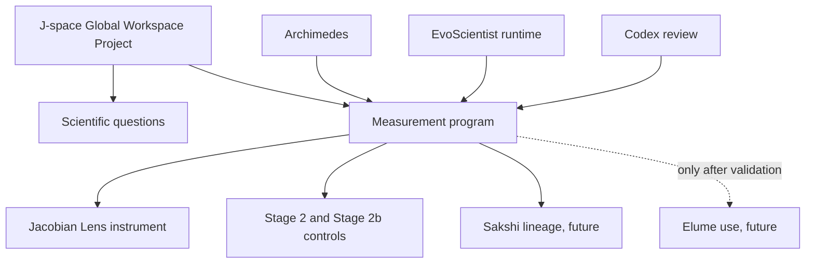
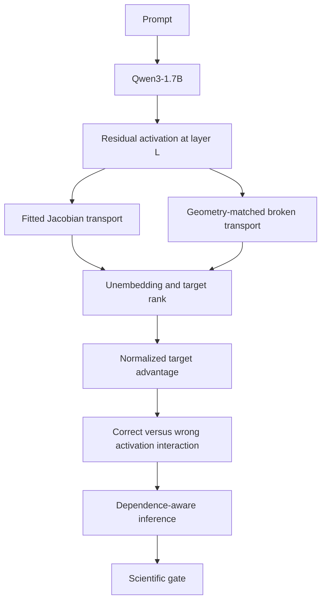
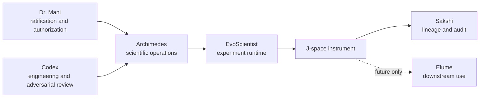

# Concepts and Relationships

## Project hierarchy

The subject is J-space and its possible global-workspace role. The surrounding
systems exist to make that subject measurable:



Archimedes, EvoScientist, and Codex are not competing project identities.
Archimedes operates the scientific process, EvoScientist provides runtime
infrastructure, and Codex verifies engineering correspondence.

## The measurement chain

The lab is not asking whether a model has an interesting internal state. It is
asking whether a particular instrument preserves target-relevant information in
a way that survives strong controls.



Each arrow can fail independently:

- the model or lens can load incorrectly;
- the activation can be captured at the wrong layer or position;
- a broken map can fail to preserve the intended geometry;
- the rank convention can disagree with Jacobian Lens;
- the artifact can lose donor or map identity;
- inference can treat repeated cells as independent;
- a report can claim more than the run established.

## Why there are two floors

Normalized target advantage compares a transported readout with a lower anchor
and the model output:

```text
NTA = (transport_score - floor_score) / (output_score - floor_score)
```

The primary floor decodes the input embedding. The sensitivity floor decodes the
layer-0 residual. They are not interchangeable descriptions of “the prompt.”
Recording both reveals whether a conclusion depends on where the lower anchor is
drawn. A required-gate reversal across floors is prompt-floor dependence, not a
robust result.

## Why eight donors and eight maps become 81 readouts

The logical experiment has 64 donor-by-map combinations per prompt and layer.
Naively recomputing four cells for each combination would require 256 readouts.
The factorized implementation reuses invariant cells:

| Readout family | Count |
|---|---:|
| Correct activation, fitted map | 1 |
| Correct activation, broken map | 8 |
| Wrong activation, fitted map | 8 |
| Wrong activation, broken map | 64 |
| **Total unique readouts** | **81** |

Those 81 values reconstruct 64 complete four-cell factorials without averaging
away donor or map identity.

## People and systems



- **Dr. Mani** ratifies measurement choices and authorizes bounded GPU actions.
- **Archimedes** operates scientific state, provenance, and stop conditions for
  the J-space project.
- **EvoScientist** is the runtime substrate and reusable operational code, not
  the scientific subject.
- **Codex** recovers and reviews implementation correspondence against the
  specification.
- **Sakshi** is the future audit/lineage consumer.
- **Elume** is a future downstream consumer and must not depend on J-space until
  the instrument clears its gates.

## Evidence classes

The completed Stage 2b pilot remains evidence class 1: an observation about
instrument behavior. Its positive sensitivity-floor signal and undefined
primary-floor result do not establish a functional, cognitive, or phenomenal
claim. Promotion requires a robust instrument result and a separately
preregistered, ratified later stage.
