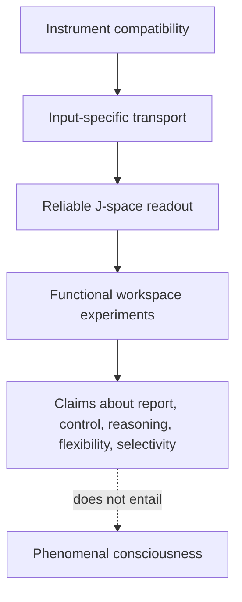

# Global Workspace and J-space

## The idea

A complicated system can contain enormous amounts of local activity without
making all of it available everywhere. A global workspace is a proposed
solution: selected information enters a shared format that many downstream
processes can read and use.

The useful distinction is functional:

- **Reportable:** the system can express the information.
- **Controllable:** instructions can summon, hold, or dismiss it.
- **Reasoning-relevant:** intermediate conclusions can be carried forward.
- **Flexible:** different operations can use the same representation.
- **Selective:** only a small fraction of ongoing processing enters the shared
  format.

This does not by itself imply subjective experience. The source research
explicitly distinguishes functional access from phenomenal consciousness and
does not claim that transformer models reproduce the full recurrent architecture
proposed for biological brains.

Primary source:
[Verbalizable Representations Form a Global Workspace in Language Models](https://transformer-circuits.pub/2026/workspace/index.html).

## Why J-space might matter

A transformer carries information through a residual-stream vector. The Jacobian
Lens estimates how a change to an intermediate residual would affect later
residuals and, after unembedding, future token scores. Averaging those Jacobians
across positions and contexts aims to isolate a general disposition to verbalize
a concept rather than a prompt-specific accident.

For layer `l`, the fitted map is:

```text
J_l = average over prompts and positions of
      d(final residual) / d(layer-l residual)
```

Applying `J_l` to an intermediate activation and then unembedding it yields a
ranked vocabulary readout. The token-indexed directions induced by these maps form
the Jacobian-Lens frame. The source work defines J-space using sparse,
non-negative combinations of those directions.

The hypothesis is that this verbalizable format may also serve as a common
currency for control, reasoning, and flexible downstream use.

## What this project is testing first

Before using the readout to study a global workspace, this project asks whether
the fitted Jacobian map behaves like a genuine measurement instrument.

Stage 2 showed that its output was neither identical to a cheap baseline nor
random noise. But the fitted readout did not clearly beat structure-broken
controls. That left a basic ambiguity:

```text
meaningful transport
        versus
generic consequence of applying a structured layer-sized map
```

Stage 2b sharpens the test. It asks whether the fitted map's advantage over a
geometry-matched broken map is larger for the correct activation than for a wrong
activation. That interaction is the bridge between “the map produces a readable
answer” and “the map preserves information specific to this internal state.”

## Relationship between levels of claim



Each arrow needs its own evidence. The bounded runtime is compatible, but the
2026-07-31 pilot left input-specific transport unresolved: the sensitivity floor
was positive while the required primary-floor inference was undefined.

## Why broken maps are useful

A broken map preserves selected geometric properties of the fitted Jacobian but
scrambles the relationship between its directions and the model's learned
computation. If fitted and broken maps behave the same, a readable output may come
from broad geometry rather than learned transport.

Using multiple broken-map draws tests whether a result depends on one convenient
scramble. Using multiple wrong-activation donors tests whether it depends on one
convenient contrast. Crossing every donor with every map separates these two
sources of variation.

## What would count as progress

The excluded-input compatibility smoke and 20-prompt pilot have now completed.
The next scientific progress would be a preregistered resolution of the
primary-floor category-coverage failure, followed only if justified by a
separately authorized run. A fitted-over-broken interaction must survive the
required prompt floors and dependence-aware uncertainty before this project can
claim a stable measurement path.

Even that would validate the measurement path, not the whole global-workspace
hypothesis. Later experiments would still need to examine report, modulation,
reasoning, flexible generalization, and selectivity separately.

## Known limitations

- A first-order averaged Jacobian is an approximation.
- Token-indexed directions favor concepts expressible as vocabulary tokens.
- Sparse decomposition requires a sparsity choice.
- A feedforward transformer does not reproduce the recurrent broadcast
  architecture often proposed for biological global workspaces.
- A convincing readout can still be wrong about why it works.

The project treats these as experimental constraints, not footnotes.
