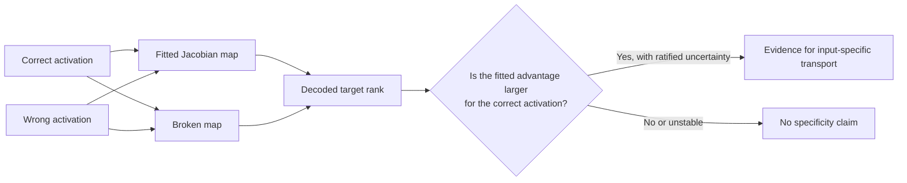

# J-space Global Workspace Project

This Wiki follows the J-space Global Workspace Project in public. Its long-range
question is whether language models contain a small, privileged representational
system that makes selected internal content available for report, control,
reasoning, and flexible use.

The immediate experiment is more modest because the instrument must earn trust
before the theory can use it: can a fitted Jacobian map read target-relevant
information from the correct activation, or does it merely produce
structured-looking output because almost any layer-sized transport would?

The project is deliberately slower than a demo. Every result is separated into:

- **Observed:** directly produced by a recorded run or verified source.
- **Inferred:** a reasoned interpretation that follows from observations.
- **Unknown:** not yet measured or not yet ratified.
- **Authorized:** a human decision permitting a specific bounded action.

That vocabulary is part of the instrument. It prevents a successful program from
being mistaken for a successful experiment.

## Current status

Updated 2026-07-31.

| Layer of work | Current state |
|---|---|
| Scientific claim | Evidence class 1 only; no functional or cognitive claim |
| Stage 1 | Self-consistency established |
| Stage 2 | Ambiguous: non-identity and non-noise, but specificity failed |
| Stage 2b design | Dual-floor, fully crossed 8 donor by 8 broken-map structure ratified |
| Stage 2b implementation | Recovered and CPU/static tested |
| Real model/lens compatibility | Established for the bounded excluded-input T4 smoke |
| 20-prompt pilot | Operationally complete; publication-workflow E4, scientific evidence class 1 |
| Pilot result | Sensitivity signal positive; preregistered robust result undefined |
| Thresholds and decision | Threshold derivation unavailable; no pilot pass/fail decision |
| 180-prompt confirmation | Publicly specified, but runtime-sealed, unaccessed, and unauthorized |

After two safe integration failures, a third exact-hash-authorized smoke
established bounded Qwen/Jacobian Lens compatibility on a T4. The separately
authorized pilot then completed. Its sensitivity floor was positive at all four
layers, but the primary floor had only two eligible arithmetic-completion prompts
against a minimum of three, so all primary inferences were undefined. Confirmation
remains blocked; see [[Stage 2b Pilot Result]].

## The question in one picture

A fitted map beating a broken map is not enough. The advantage must be specific
to the correct activation. Otherwise the map may be exploiting geometry without
preserving the information the experiment claims to measure.

## Explore

- [[Concepts and Relationships]]
- [[Global Workspace and J-space]]
- [[Why IWMT Matters]]
- [[Thoughtseeds, IWMT, and the J-space Research Horizon|Thoughtseeds-IWMT-and-the-J-space-Research-Horizon]]
- [[Stage 2b Experiment]]
- [[Stage 2b Pilot Result]]
- [[Evidence Ledger]]
- [[Runtime Failure Lab Notes]]
- [[Reproducibility and Gates]]
- [[Wiki Maintenance]]

## Repository anchors

This project currently lives inside an EvoScientist fork, but EvoScientist is
runtime infrastructure rather than the scientific subject. Archimedes is the
scientific operator; Jacobian Lens is the instrument under evaluation.

The Wiki is explanatory. These repository files govern the work:

- `.specify/memory/constitution.md`
- `.specify/memory/project-state.md`
- `specs/001-jspace-stage2b/spec.md`
- `specs/001-jspace-stage2b/plan.md`
- `specs/001-jspace-stage2b/tasks.md`
- `specs/001-jspace-stage2b/data-model.md`
- `specs/001-jspace-stage2b/contracts/`
- `docs/research/jspace-hypothesis-ledger.md`
- `docs/research/jspace-paper-pipeline.md`

When Wiki prose and a governing source disagree, the governing source wins and
the Wiki must be corrected.
