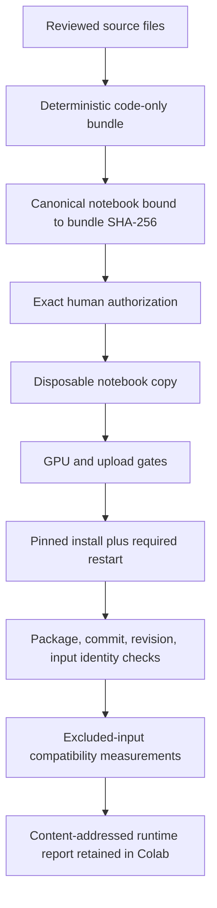

# Reproducibility and Gates

## Source-to-runtime chain



No arrow may be skipped. A changed byte creates a new source identity.

## Canonical versus disposable notebooks

The canonical notebook must contain:

```python
INTEGRATION_SMOKE_AUTHORIZED = False
ARTIFACT_TRANSFER_AUTHORIZED = False
```

The launch-copy tool verifies the canonical SHA-256, changes only the smoke
authorization flag, records the authorization-record SHA-256 in notebook metadata,
and preserves transfer as false.

## Completed pilot identities

Exact-hash authorized and run 2026-07-31:

| Source | SHA-256 |
|---|---|
| Canonical notebook | `9564236a1f49d7ffe2bea44f8b04be5a584c0ff9740b11dd1e563c93b8dba2fe` |
| Code-only bundle | `aeec8a76a426fa82f3fb96dc6700289a689fcb92fd9952da681fe03fe12dbef4` |
| Pilot view | `5bef8316f72682a628fc1240bf6068a91aa7c8a330377206cbd9145434b797e4` |
| Authorization record | `1af4ec95bf1c0f257fa5f559b7a91c939723cb7382eb0f5812ebc113d842b63c` |

The retained artifact SHA-256 is
`d138846e7a189ad42955a5990e6d1a5c00553ba768cd838c5b6bf0334095daef`.
It was retained in Colab at pilot completion and was never transferred. A later
check found the artifact and pilot view absent from the active `/content` runtime
before the bounded mechanism audit could read them. That state is consistent
with a reset or replacement, but the precise lifecycle event is unknown. The
curated aggregate [public record](https://github.com/bionicbutterfly13/EvoScientist/tree/main/runs/stage2b-pilot-public-record-20260731)
is published alongside separately tracked protocol inputs; the result artifact
itself is not present here or in the active Colab runtime.

## Local verification

```bash
uv run pytest tests/jspace -q
uv run pytest -q
uv run ruff check .
uv run ruff format --check .
git diff --check
```

The notebook and bundle builders are also rerun into a temporary directory and
compared byte-for-byte with the candidate sources.

## Runtime stop conditions

The integration smoke stops if:

- the authorized hashes do not match;
- GPU count is not one or VRAM is below 14 GiB;
- the fresh-process sentinel is missing or stale;
- Torchvision remains installed or importable;
- package, model, lens, or instrumentation identity differs;
- an input is outside the nine fixed smoke identities;
- rank or transport parity fails;
- 81 unique readouts or 64 logical cells do not materialize;
- raw prompts, activations, or full logits would be persisted;
- a scientific field appears in the runtime report;
- artifact transfer is requested without separate authorization.

## Separate decisions

These are intentionally independent:

1. approve a source design;
2. authorize an excluded-input GPU smoke;
3. ratify statistical rules;
4. authorize the 20-prompt pilot (spent on the completed 2026-07-31 run);
5. authorize artifact transfer;
6. authorize confirmation-set access;
7. authorize publication of scientific results.

Success at one gate does not imply approval at the next.

The full 200-prompt manifest is public source material. Runtime sealing is a
separate boundary: the pilot reported `holdout_accessed: false`, so the
confirmation subset remained unaccessed even though its specification was
public. Confirmation thresholds are false/unratified, and confirmation execution
is not authorized.
