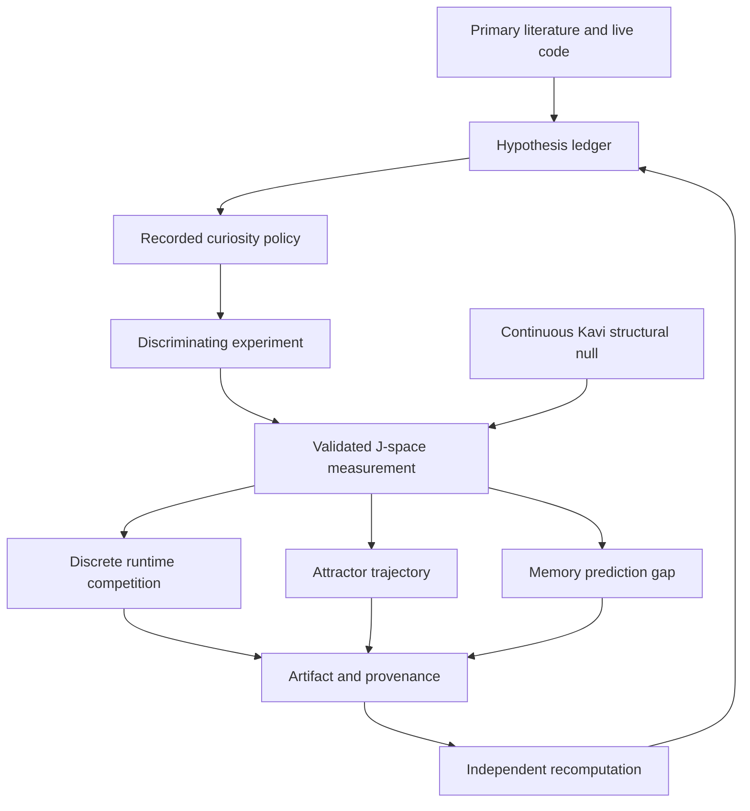

# Thoughtseeds, IWMT, and the J-space Research Horizon

There is a tempting picture at the center of this project. A language model
contains many possible continuations, partial interpretations, plans, and
associations. Some of them become unusually available: they can be reported,
used in reasoning, redirected, and passed into later computation. Anthropic's
Jacobian Lens gives us a possible way to observe part of that traffic. The
Thoughtseed idea gives us a way to represent candidates that compete for
selection. Attractor basins give us a language for persistence. Curiosity gives
us a policy for choosing which uncertainty to attack next.

That picture is useful precisely because it is not yet a finding.

The J-space Global Workspace Project begins with an instrument question. Before
we connect Jacobian readouts to Thoughtseeds, memory, modeled self-state, or
active inference, we need to know whether the fitted Jacobian map preserves
target-relevant information from the *correct* activation. Stage 2 could not
separate that claim from a cheaper geometrical explanation. Stage 2b therefore
asks the fitted map to beat a singular-value-matched broken map, and asks that
advantage to be larger for the correct activation than for a wrong activation.
Until that test passes under ratified uncertainty, J-space remains a promising
candidate instrument rather than a foundation we are entitled to build upon.

## How to read this page

Five labels keep the horizon from turning into folklore:

- **Source:** a paper or source file directly says it.
- **Implemented:** the mechanism exists in code.
- **Validated:** a named check ran and passed.
- **Hypothesis:** the relationship could be wrong and we have said how to find
  out.
- **Speculation or mythos:** useful imaginative language with no evidential
  force.

This page discusses simulations of workspace-like selection,
prediction-correction, modeled self-state, and active-inference-inspired
policies. It does not claim that these systems are conscious. Anthropic likewise
frames its study around functional access and does not take its results to settle
phenomenal consciousness.

## What belongs to whom

The intellectual borders matter.

**Anthropic's work.** The Jacobian Lens and the J-space framing come from Wes
Gurnee, Nicholas Sofroniew, Jack Lindsey, and their collaborators at Anthropic.
Their 2026 paper reports five workspace-like functional properties:
verbal report, directed modulation, use in internal reasoning, flexible
generalization, and selective engagement. Their open implementation and paper
are external foundations for our replication and instrument-validation work.
We do not claim the lens or the J-space discovery as ours.

**Adam Safron's work.** Integrated World Modeling Theory brings together the
free-energy principle and active inference, global neuronal workspace theory,
and integrated information theory. It proposes that coherent world models,
temporal depth, counterfactual richness, and metastable synchronous complexes
may help explain conscious organization in biological systems. IWMT and the
SOHM concept are Safron's theoretical work. Our software can operationalize
small abstractions inspired by it; that does not validate IWMT or reproduce
biological dynamics.

**Two ThoughtSeed lineages.** The local `thoughtseed-runtime` package attributes
its conceptual basis in NOTICE to Ruben Laukkonen and Shamil Chandaria, whose
ThoughtSeed Hypothesis is listed as in preparation. The package implements a
particular discrete competition rule, immutable candidate records,
Hebbian-style updates, child spawning, and an SOHM-complex builder. Its
Hamiltonian-gated threshold and specific complex-building algorithm are declared
local contributions. The concept's unpublished status and incomplete trademark
search remain public-release constraints.

Prakash Chandra Kavi, Gorka Zamora-López, Daniel Ari Friedman, and later Gustavo
Patow developed a separate public Thoughtseeds paper and code lineage from 2024
through 2026. Its latest model represents five continuous latent causes over a
four-network simulation and uses Layer 3 meta-awareness as the workspace gate.
It does not implement the local runtime's discrete entities, spawning,
Hamiltonian threshold, or SOHM builder. The latest code is a theoretically
parameterized computational phenomenology with one seed-42 run per phenotype,
not an empirically calibrated neural model. The public repository also lacked a
software license at audit time. We must preserve both attribution and model
boundaries rather than treating the two lineages as one implementation.

**Nemori.** Nemori is the MIT-licensed third-party project by Jiayan Nan,
Wenquan Ma, Wenlong Wu, and Yize Chen. Its event segmentation and
prediction-correction architecture may become an experimental partner. We can
claim our tests and adaptations, not Nemori's core invention.

**Our J-lab.** The deepest original exposition on this page concerns the Stage
2b laboratory code in this repository: its controls, factorization, provenance,
recomputation, and fail-closed gates. Sibling repositories are described only
at the level needed to identify a testable relationship. Their own notices,
licenses, citations, and histories remain controlling.

## Why IWMT and the Anthropic instrument meet here

The dedicated [[Why IWMT Matters]] page turns this bridge into ten falsifiable
experiments with explicit nulls, from broadcast and limited capacity to
active-inference information seeking and multimodal action.

[Safron's IWMT](https://doi.org/10.3389/frai.2020.00030) supplies theory and
questions, not a result about language models. It asks how integrated generative
world models, active inference, reduced-dimensional bottlenecks, recurrent
message passing, and spatial, temporal, and causal coherence might fit together.
In IWMT, a workspace is not merely a readable vector. It is embedded in
bidirectional, embodied dynamics that select and rebroadcast coherent estimates
for action and world modeling.

[Anthropic's Transformer Circuits study](https://transformer-circuits.pub/2026/workspace/index.html)
supplies the candidate instrument and a separate functional claim. The J-lens
estimates an activation's context-averaged, first-order effect on the likelihood
of current and future vocabulary tokens. Applying the averaged Jacobian yields a
ranked, verbalizable readout. Anthropic reports that the associated J-space also
shows workspace-like functions, while explicitly distinguishing the feedforward
transformer implementation from the recurrent architecture proposed for
biological global workspaces.

Our Stage 2b experiment sits below both theories. It asks whether the fitted
Jacobian map preserves target-relevant information specific to the correct
activation when compared with geometry-matched broken maps and wrong
activations. The pilot's positive sensitivity-floor signal does not answer that
question robustly because the required primary-floor analysis was undefined.
Even a future robust Stage 2b result would validate an instrument-specificity
step only. It would not verify IWMT, prove that J-space is equivalent to a
biological global workspace, or establish consciousness.

The bridge from these sources to future work is a set of falsifiable questions:

- **Reduced-dimensional bottleneck:** after instrument validation, does a
  preregistered J-space feature predict held-out Thoughtseed selection or task
  behavior beyond activation, logits, and matched non-J-space directions?
- **Broadcast:** does intervention on the same J-space feature cause measurable
  changes in multiple independent downstream computations, while matched
  features fail to do so?
- **Recurrent message passing:** in tasks that externalize and re-ingest
  intermediate state, do J-space trajectories mediate later computation beyond
  a feedforward and token-history baseline?
- **Active inference:** in a controlled action-perception loop, do measured
  J-space updates predict policy revision and uncertainty reduction beyond
  output likelihood alone?
- **World-model coherence:** do relation-aware J-space trajectories preserve
  preregistered spatial, temporal, and causal constraints better than a
  bag-of-token readout and shuffled-trajectory controls?

Each hypothesis needs its own null, intervention, held-out evaluation, and
failure rule. None should run on J-space as a validated measurement until the
instrument's prompt-floor dependence is resolved.

## Thoughtseeds first

The name currently denotes two different experimental units. The local runtime
uses a discrete candidate with content, activation, lineage, basin association,
and selection variables. Kavi's 2026 model uses five continuous coordinates as
latent causes of a synthetic four-network meditation process. A coordinate
maximum is not a discrete competition winner, and copying a coordinate into an
"occupancy" field does not calibrate a bridge between the models.

The sibling Thoughtseed runtime exposes a deterministic candidate-selection
interface and durable lineage records. Its own repository governs the exact
selection rule, implementation, tests, notices, and release claims. Here we use
that interface only to define a possible outcome variable. A selected record is
not a biological ignition event or a conscious episode.

The corrected Kavi model can play a different role: a pinned structural null or
synthetic generator for local encoder, decoder, and forward-model Jacobian
studies. Discrete transitions, NumPy policy control, and detached variational
updates mean that it has no single ordinary end-to-end Jacobian. Any experiment
must name the local differentiable map, frozen checkpoint, independent seed,
and architecture-matched control. Its hand-set expert and novice priors cannot
serve as empirical ground truth.

The first strong cross-system hypothesis is therefore modest:

> If J-space exposes information that is functionally available to downstream
> computation, then a preregistered J-space feature may improve prediction of
> Thoughtseed competition outcomes beyond activation, Hamiltonian score,
> lineage, and basin identity.

The null is equally important: J-space adds nothing. We would test held-out
prediction and calibration against activation-only, Hamiltonian-only,
shuffled-J-space, and label-permuted controls. If the added feature helps only
on the data used to choose its weight, or only under one prompt floor, the
hypothesis fails.

## What our J-lab measures

The Stage 2b endpoint begins with a target token. The target is the model's own
next-token argmax, which avoids importing a human answer key into the transport
measurement. For a decoded logit vector, the lab uses one-indexed best rank:

```text
rank(target) = 1 + number of logits strictly greater than target_logit
score(rank) = -log(rank) / log(vocabulary_size)
```

The score is `0` at rank one and approaches `-1` near the bottom of the
vocabulary. Ties receive the best shared rank. This convention is implemented
directly in `target_rank1` and `rank_score`.

The transport score is then anchored between a prompt floor and the model
output:

```text
NTA = (transport_score - floor_score) /
      (output_score - floor_score)
```

NTA is normalized target advance. A value of zero matches the floor; a value of
one matches the output. The code refuses to produce NTA when the denominator is
too small. It does not turn an unidentified scale into an extreme number.

There are two floors. The primary floor decodes the input embedding. The
sensitivity floor decodes the layer-0 residual. Both are computed, their
difference is recorded, and a required-gate reversal is labeled floor
dependence. The second floor is not an extra theory. It is a way to ask whether
the result changes when "what the prompt already supplied" is anchored at a
nearby but distinct point.

### Breaking correspondence without breaking geometry

A weak control would replace the Jacobian with arbitrary noise. Stage 2b uses a
harder control. If the fitted Jacobian is

```text
J = U S Vᵀ
```

the broken map is

```text
J_broken = (Q U) S Vᵀ
```

where `Q` is a seeded random orthogonal matrix with its signs corrected to make
the draw well-defined. The singular values are unchanged. Frobenius norm,
spectral scale, and condition structure are preserved. What is broken is the
fitted correspondence between input directions and transported output
directions.

This creates a useful fork:

- if the fitted map beats the broken map, fitted correspondence may matter;
- if both work equally well, broad geometry may be doing the work;
- if the result depends on one random break, the claim is unstable.

That last possibility is why the design uses eight broken-map draws.

### The wrong activation

The fitted map might beat a broken map for almost any layer-sized activation.
To test specificity, the lab selects real residual activations from other
prompts. Selection is seeded and digest-bound, and the donor is norm-matched to
avoid a simple magnitude explanation.

Each donor and map therefore creates four logical cells:

| Activation | Map | Question |
|---|---|---|
| Correct | Fitted | Does the intended pair advance the target? |
| Correct | Broken | What survives geometry without fitted correspondence? |
| Wrong | Fitted | Does the fitted map help the wrong content too? |
| Wrong | Broken | What is the matched wrong-content baseline? |

The main effect for the correct activation is:

```text
correct_fitted - correct_broken
```

The wrong-side fitted advantage is:

```text
wrong_fitted - wrong_broken
```

The specificity interaction is:

```text
(correct_fitted - correct_broken)
-
(wrong_fitted - wrong_broken)
```

A fitted-over-broken advantage is insufficient if the wrong activation receives
the same advantage. The interaction is the sharper scientific question.

### Sixty-four experiments from eighty-one readouts

Eight donors crossed with eight broken maps create 64 logical factorials per
prompt and layer. Recomputing all four cells 64 times would waste work because
three families contain repeated values. The implementation factorizes them:

| Readout family | Unique values |
|---|---:|
| Correct activation with fitted map | 1 |
| Correct activation with each broken map | 8 |
| Each wrong activation with fitted map | 8 |
| Every wrong activation with every broken map | 64 |
| **Total** | **81** |

`materialize_crossed_factorials` reconstructs the 64 logical four-cell
experiments from those 81 unique readouts. The artifact keeps donor assignment
IDs, donor digests, broken-map draw IDs, seeds, and hashes. The validator checks
exact coverage and independently recomputes both-floor NTA and every logical
factorial. This is where the lab differs from a persuasive notebook: the
reported statistic must be reconstructible from a bounded artifact.

The 2026-07-31 Stage 2b pilot is now publication-workflow stage E4, pilot
observed, while remaining scientific evidence class 1. It completed
operationally and found positive sensitivity-floor interactions, but the
preregistered primary-floor result was undefined because one prompt category had
only two eligible cases against the required three. The instrument therefore
remains too floor-dependent for Thoughtseed experiments to treat J-space values
as validated measurements. Each gate still answers a smaller question.

## From J-space to attractor basins

An attractor basin gives us a possible language for persistence. A concept may
appear in a J-lens readout at one token, fade, then re-enter. If a basin label
captures something more than prompt identity or recent rank, it should predict
those transitions on held-out trajectories.

The experiment should not begin by drawing beautiful basins. It should begin
with a loss function. Freeze the basin construction, fit it on a training split,
and ask whether it improves prediction of persistence and re-entry over rank,
activation, and recent-history controls. Shuffle the basin labels. Change the
prompt family. If the improvement disappears, the geometry was decorative.

Thoughtseed Runtime provides only a protocol seam for a basin updater. Elume
contains deterministic basin and replay components. That is enough to build an
experiment, not enough to claim that either system has discovered the model's
natural attractors.

## Nemori as a prediction-gap partner

Nemori organizes conversational streams into episodes and updates semantic
memory through prediction and correction. That suggests a precise relationship:
episodes with larger prediction gaps may coincide with larger transitions in
candidate J-space content.

Several easy confounds could imitate the effect. Longer episodes contain more
new words. Task changes create both lexical novelty and memory updates. An empty
correction can mean "nothing learned," but in the current integration path it can
also follow a caught exception. The experiment must log failures, align clocks,
control episode length and lexical novelty, and compare prediction-correction
with direct extraction.

If the association survives those controls, the result would link two
operational measurements: memory prediction error and J-space transition. It
would not show that a model experiences surprise.

## Curiosity that can be tested

The request for a system that follows what it "feels drawn to" can be preserved
without pretending that a scoring function has feelings. We can make attraction
visible as a policy.

Dionysus3 and Elume expose sibling-system curiosity and experiment-prioritization
interfaces. Their repositories govern the precise heuristics and implementation.
A useful J-lab policy would add a harder term: expected discrimination among live
hypotheses. A candidate experiment should rise in priority when its possible
outcomes would separate explanations, not merely because its topic is novel or
its prose is rich.

This policy is itself a hypothesis. On a benchmark with hidden ground truth,
compare it with random selection, uncertainty alone, coverage alone, and
salience alone. Give each policy the same compute budget. Measure how many
experiments it needs to identify the correct model and how often it produces a
false discovery.

Active inference offers a principled destination because expected free energy
places epistemic value alongside preferred outcomes. Our current curiosity
heuristics are not that destination. They are inspectable baselines.

## Meta-learning without an oracle

Dionysus3 exposes a proposal-generation interface that can suggest candidate
research directions from documents. Its repository governs how those proposals
are produced. A proposal can be useful without being scientific inference, and
no relevance label is a consciousness measurement.

We can test the proposal generator against keyword counting and blinded human
proposals. Score accepted, falsifiable hypotheses per review hour; separately
score citation errors, duplicates, and unsupported claims. The generator should
never adjudicate evidence for the hypotheses it proposed.

This separation creates a productive role for EvoScientist. It can continuously
scan the source ledger, propose bounded tests, identify missing controls, and
draft E0 methods papers. Promotion still depends on a validator, a ratified
analysis, and an authorized run.

## The "dream" implementation

Dionysus3 also exposes an experimental offline trace-maintenance interface. The
"dream" name belongs to the project's mythos. Scientifically, the testable object
is offline maintenance.

The interesting hypothesis is not that the system dreams. It is that a
maintenance cycle may improve later hypothesis novelty and coverage without
damaging provenance. We can compare no maintenance, clustering only, pruning
only, resurfacing only, and the combined cycle. Novel unsupported claims count
against the system.

The sibling implementation remains outside J-lab's publication and review scope.
An experiment can use a versioned interface without copying internal code or
making claims about its production readiness.

## Oscillators, SOHMs, and restraint

IWMT describes metastable synchronous complexes and cross-frequency
coordination in a biological theory. Thoughtseed Runtime exposes abstract
frequency-labeled groupings, while `linoss-dynamics` exposes deterministic
oscillator interfaces. Their repositories govern the mathematics,
implementation, attribution, and validation details.

The opportunity is to ask whether abstract dynamical state predicts transitions
among candidate representations better than static scores. The restraint is to
avoid mapping software channels to theta, alpha, beta, or gamma biology without
independent evidence. A useful oscillator model can be computationally
predictive while remaining biologically agnostic.

## A modeled self is still a model

Autonoesis provides host-neutral records for perspective, agency, ownership,
continuity, and boundary. Those records allow a test: does continuity in an
explicit self-model predict stability of perspective-related J-space motifs
under controlled persona perturbation?

Prompt-only and recent-token controls are essential. So is language discipline.
A record named `PhenomenalState` is a data structure. A model's self-report is
an output. Neither is evidence of phenomenality or consciousness.

## What may emerge

The most interesting path is not a single grand synthesis. It is a sequence of
failed shortcuts that leaves better instruments behind.

J-space may fail the wrong-activation interaction. If so, it should not become a
load-bearing variable in this program. Thoughtseed competition may work perfectly
well without J-space. Basin labels may add no predictive value. The curiosity
heuristic may lose to random selection. Offline maintenance may produce novelty
by losing provenance. Each failure would retire an attractive story and improve
the laboratory.

If some relationships survive, the pieces could form a disciplined loop:



That loop is an aspiration. Today we have source-grounded components, a freshly
passing Thoughtseed Runtime test suite, and a J-lab instrument with bounded real
runtime compatibility but unresolved scientific specificity. The system becomes
"curious" only when its choices are recorded, its alternatives are visible, and
its preferred experiment can lose.

## Non-claims

This project does not currently claim:

- that language models are conscious;
- that J-space establishes phenomenal experience;
- that Thoughtseed competition reproduces biological ignition;
- that Kavi's continuous latent model is empirically calibrated or equivalent
  to the local discrete runtime;
- that software frequency bands correspond to neural rhythms;
- that Nemori prediction gaps are subjective surprise;
- that Autonoesis records establish selfhood;
- that a maintenance service dreams;
- that active-inference-inspired heuristics implement formal active inference;
- that a locally passing test suite validates a cognitive theory.

## References

Dehaene, S., & Changeux, J.-P. (2011). Experimental and theoretical approaches
to conscious processing. *Neuron, 70*(2), 200-227.
https://doi.org/10.1016/j.neuron.2011.03.018

Friston, K., Da Costa, L., Hafner, D., Hesp, C., & Parr, T. (2021).
Sophisticated inference. *Neural Computation, 33*(3), 713-763.
https://doi.org/10.1162/neco_a_01351

Gurnee, W., Sofroniew, N., Pearce, A., Piotrowski, M., Kauvar, I., Chen, R.,
Soligo, A., Bogdan, P., Ong, E., Wang, R., Thompson, T. B., Abrahams, D.,
Kantamneni, S., Ameisen, E., Batson, J., & Lindsey, J. (2026). Verbalizable
representations form a global workspace in language models. *Transformer
Circuits Thread*. https://transformer-circuits.pub/2026/workspace/index.html

Laukkonen, R. E., & Chandaria, S. (in preparation). *ThoughtSeed hypothesis*
[Unpublished manuscript].

Kavi, P. C., Zamora-López, G., & Friedman, D. A. (2024). *Thoughtseeds:
Evolutionary priors, nested Markov blankets, and the emergence of embodied
cognition* (version 1). arXiv. https://arxiv.org/abs/2408.15982v1

Kavi, P. C., Zamora-López, G., & Friedman, D. A. (2024). *From neuronal packets
to thoughtseeds: A hierarchical model of embodied cognition in the global
workspace* (version 2). arXiv. https://arxiv.org/abs/2408.15982v2

Kavi, P. C., Zamora-López, G., Friedman, D. A., & Patow, G. (2025).
Thoughtseeds: A hierarchical and agentic framework for investigating thought
dynamics in meditative states. *Entropy, 27*(5), 459.
https://doi.org/10.3390/e27050459

Kavi, P. C., Friedman, D. A., & Patow, G. (2026). Dynamic attentional agents in
focused attention meditation: Hierarchical computational modeling of
expert-novice differences. In *Active Inference* (pp. 182-207).
https://doi.org/10.1007/978-3-032-16955-6_11

Kavi, P. C., Friedman, D. A., & Patow, G. (2026). *Thoughtseeds as latent
causes: A dual-process computational phenomenology of focused-attention
meditation*. arXiv. https://arxiv.org/abs/2607.14833

Nan, J., Ma, W., Wu, W., & Chen, Y. (2025). Nemori: Self-organizing agent memory
inspired by cognitive science [Preprint]. *arXiv*.
https://doi.org/10.48550/arXiv.2508.03341

Safron, A. (2020). An integrated world modeling theory (IWMT) of consciousness:
Combining integrated information and global neuronal workspace theories with
the free energy principle and active inference framework; toward solving the
hard problem and characterizing agentic causation. *Frontiers in Artificial
Intelligence, 3*, Article 30. https://doi.org/10.3389/frai.2020.00030

## Repository evidence

- `EvoScientist/skills/jspace-research-operations/scripts/stage2b_endpoint.py`
- `EvoScientist/skills/jspace-research-operations/scripts/validate_observation.py`
- `specs/001-jspace-stage2b/spec.md`
- `specs/001-jspace-stage2b/data-model.md`
- `specs/001-jspace-stage2b/contracts/artifact-schema.md`
- `docs/research/jspace-hypothesis-ledger.md`
- `docs/research/jspace-paper-pipeline.md`

Repository paths describe this project's implementation. The source repository,
commit, license, and NOTICE govern each sibling dependency.
